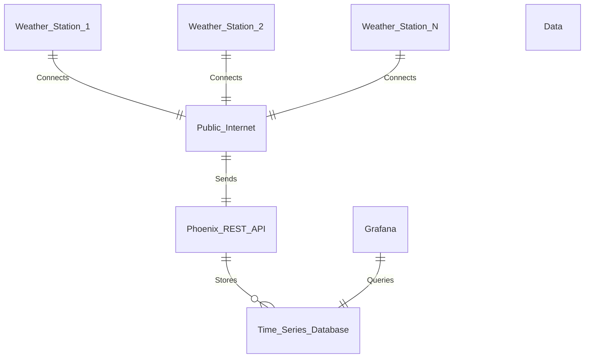

# SensorHub

**Description**  
This is the code for my weather app that I will make using the book [Build a Weather_Station_with Elixir and Nerves](https://pragprog.com/titles/passweather/build-a-weather-station-with-elixir-and-nerves/).  
  
This will use Nerves and Elixir you will also need to buy a [Rasberry Pi](https://www.pishop.us/product/raspberry-pi-zero-2w-with-headers/?searchid=0&search_query=zero+w) and an [evironmental hat](https://www.pishop.us/product/environment-sensor-hat-for-raspberry-pi-i2c-bus/?searchid=0&search_query=i2c+hat) that will keep scan the envrionment and upload the data to a database.  

**Workflow**  
